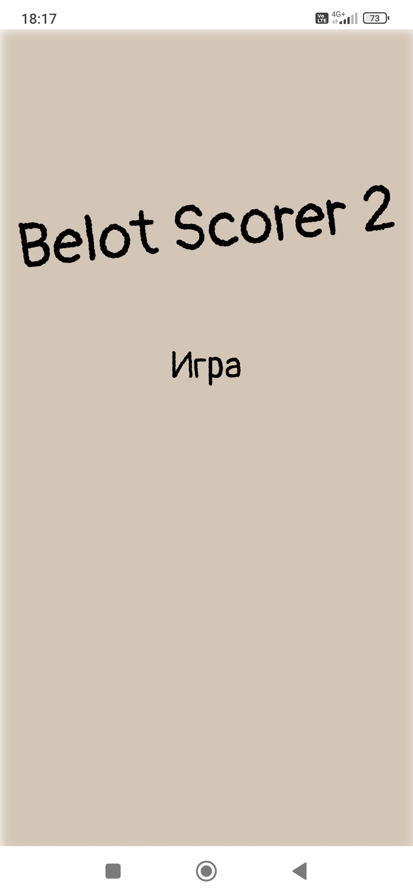
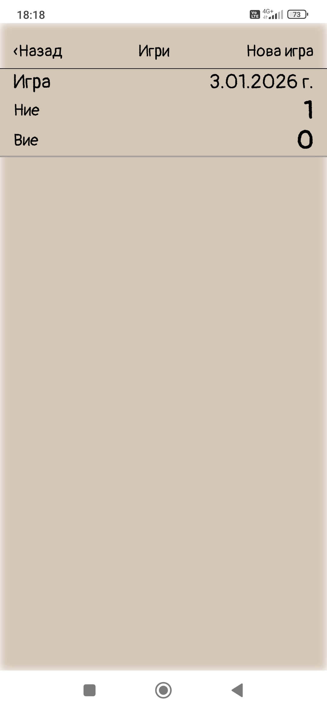
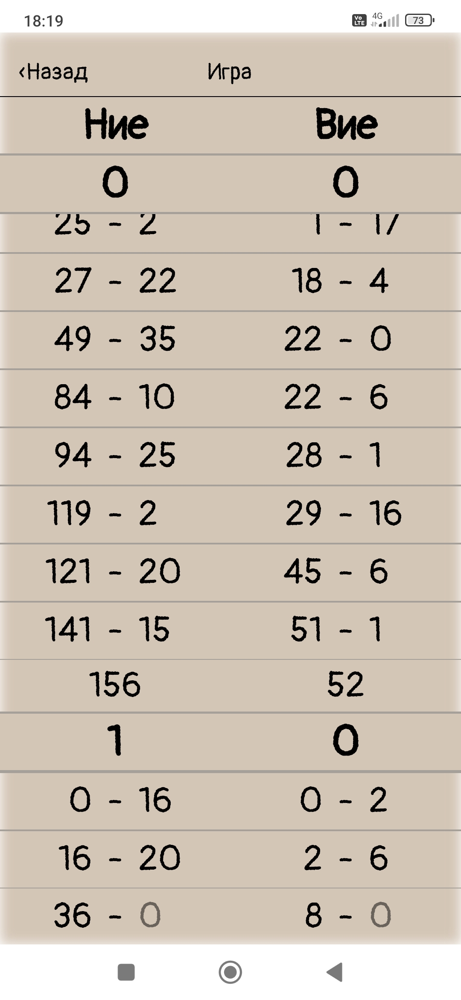

# Belot Scorer 2

**Belot Scorer 2** е мобилно приложение за лесно и бързо следене на резултатите при игра на **Бридж-Белот**. Приложението автоматизира изчисляването на точките и поддържа пълна хронология на игрите.

**Belot Scorer 2** is a mobile application for easy and fast score tracking for the game **Bridge-Belote**. The app automates point calculations and maintains a full match history.

---

## 🚀 Функционалности / Features

* **Български:**
    * **Автоматично изчисляване:** Следене на резултатите в реално време за двата отбора ("Ние" и "Вие").
    * **История на игрите:** Пълен запис на всяко раздаване и краен резултат.
    * **Изчистен интерфейс:** Оптимизиран дизайн за бързо въвеждане.
* **English:**
    * **Automatic Calculation:** Real-time score tracking for both teams ("Us" and "Them").
    * **Game History:** Complete logs of every round and final results.
    * **Clean Interface:** Optimized design for fast data entry during gameplay.

## 🛠 Технологии / Technologies

* **React** – Приложението е разработено с React. / Built with React.
* **Android (APK)** – Налично готово APK за инсталация. / Ready-to-install APK available.

## 📱 Скрийншоти / Screenshots

  
  
  

---

## 📥 Инсталация / Installation

Приложението е налично за Android. / The app is available for Android.

👉 **[Изтегли / Download Belot-Scorer-2.apk](https://github.com/petko-todorov/belot-scorer/releases/download/v1.0.0/Belot-Scorer-2.apk)**

---